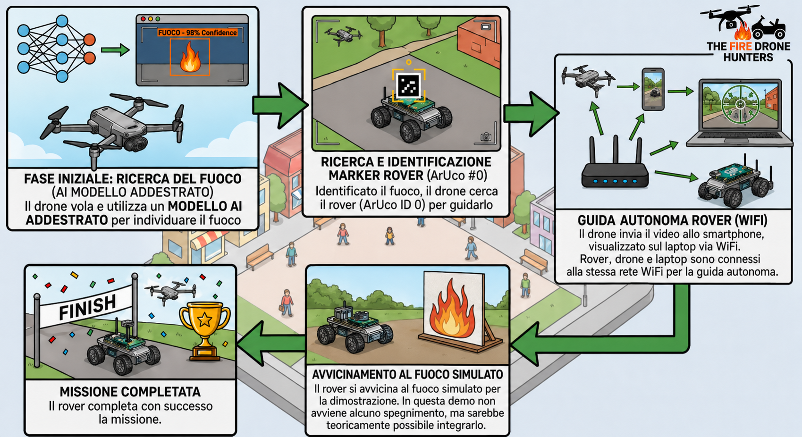
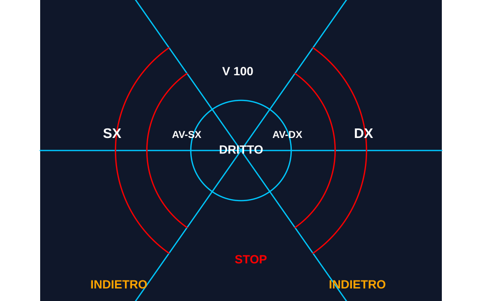

# DroneBotGiorgi

Progetto sviluppato per la RomeCup 2026 dall'IIS Giorgi di Milano.

Il sistema implementa un flusso in due fasi con lo stesso drone: rilevamento del target (fuoco) e guida visiva di un rover verso la posizione rilevata. La base software condivisa e unica; cambia soltanto il backend rover.

Schema generale del flusso di progetto:

## Scopo e perimetro

L'obiettivo e validare una pipeline end-to-end in arena ridotta (drone + rover) senza infrastruttura esterna di localizzazione. In particolare:

- percezione del target tramite modello YOLOv8;
- stima della posa del rover tramite marker ArUco nel frame del drone;
- generazione comandi di guida con logica discreta a zone;
- esecuzione su tre piattaforme rover eterogenee.

## Architettura operativa

### Fase 1: detection del target

Il modulo `detector` processa il feed video del drone (ADB/scrcpy, con fallback webcam o RTMP) e produce lo stato di rilevamento. L'entrypoint principale e `detector.main`.

Dettagli di addestramento YOLOv8:

- pipeline esterna dedicata: https://github.com/DroneBotGiorgi/yolo-fire-detector
- generazione dataset sintetico con compositing di sorgenti fuoco su sfondi variabili (sia geometrici, che scaricati da Unsplash programmaticamente);
- hard negative mining su footage reale per ridurre falsi positivi in scenario arena;
- preset YAML distinti per strategie diverse (es. alta recall vs anti-falsi-positivi);
- training su Colab/GPU con esportazione del checkpoint `.pt` usato dal modulo `detector`.

Nel repository corrente il runtime usa `detector/settings.yaml` (soglie, modello, frequenza inferenza), mentre il ciclo train/val/test e nel repository dedicato sopra.

### Fase 2: guida del rover

Il server `server/server.py` usa la stessa catena video del drone per rilevare il marker ArUco montato sul rover. La distanza viene stimata con `solvePnP` (profondita), mentre il comando di guida e determinato da un HUD a 8 zone bitmap configurato in `server/settings.py`.

In pratica la guida funziona cosi: il sistema guarda dove cade il marker nel frame del drone, capisce in che direzione deve andare il rover e con quale intensita, poi invia il comando al backend rover del team.

Schema HUD (illustrazione):

I comandi sono intenzionalmente semplici:

- `cmd`: che manovra fare (avanti, curva, stop...)
- `v_mult`: quanto forte farla (scala tra `0` e `1`)

Ogni team implementa questa stessa decisione con il proprio backend rover (SDK diretto, client Python TCP, firmware Arduino). I dettagli di trasporto e attuazione sono nei documenti team-specifici.

## Scelte implementative comuni

- Pipeline unificata drone -> visione -> controllo, riusata su tutte le varianti rover.
- Protocollo di comando coerente per disaccoppiare decisione (server) ed esecuzione (client rover).
- Parametrizzazione centralizzata in `server/settings.py` e `detector/settings.yaml`.
- Calibrazione camera esplicita (`tools/calibration.py`) con salvataggio parametri in YAML.

## Varianti rover (tre team)

La differenza tra i team e nel livello di attuazione, non nella logica di percezione/decisione.

- Team 1 - RoboMaster EP Core: controllo diretto via SDK DJI (`team1/robomaster_api.py`) con backend simulato (`team1/simulator_api.py`).
- Team 2 - PiCar-X: client Python TCP (`team2/client_picar.py`) con gestione attuazione locale.
- Team 3 - Arduino 4WD: firmware C TCP (`team3/client_arduino.c`) con controllo differenziale DRV8833.

I dettagli tecnici su invio, parsing e processamento dei comandi sono nei documenti team-specifici.

## In conclusione: punti di forza

- Un solo drone, due ruoli reali nella stessa missione: prima detection del target, poi guida rover visuale.
- Pipeline end-to-end senza infrastruttura esterna di localizzazione: tutto si regge su video, marker e stima posa.
- Architettura modulare ma coerente: stessa logica di decisione, tre backend rover diversi, confronto tecnico diretto tra team.
- Addestramento YOLOv8 dedicato allo scenario gara con dataset sintetico e hard negative mining su footage reale.
- Guida discreta a zone con HUD bitmap: comportamento interpretabile, tarabile in campo e robusto al rumore visivo.
- Protocollo comando essenziale e portabile (`cmd` + `v_mult`), facile da integrare su SDK, client Python e firmware embedded.
- Forte valore ingegneristico-didattico: visione artificiale, networking, controllo rover e integrazione hardware/software in un unico progetto.

## Limiti e ipotesi operative

- Qualita della guida dipendente dalla visibilita del marker nel frame del drone.
- Accuratezza metrica legata alla calibrazione effettiva della camera.
- Robustezza complessiva sensibile a latenza video e jitter della catena ADB/scrcpy.
- La logica di controllo e discreta (zone), quindi non ottimizza traiettorie continue come un controllore PID/MPC.

## Documenti del repository

Documenti di valutazione:

- `documentation/BOM.MD`: bill of materials hardware unificata
- `documentation/SBOM.MD`: software bill of materials unificata
- `documentation/TEAM1.MD`, `documentation/TEAM2.MD`, `documentation/TEAM3.MD`: dettagli implementativi per ciascun team
- `documentation/TEAM1_FLOW.svg`, `documentation/TEAM2_FLOW.svg`, `documentation/TEAM3_FLOW.svg`: diagrammi di flusso semplificati

Documenti operativi:

- `QUICKSTART.MD`: avvio rapido (assume installazione gia completata)
- `INSTALL.MD`: installazione, ambienti e prerequisiti
