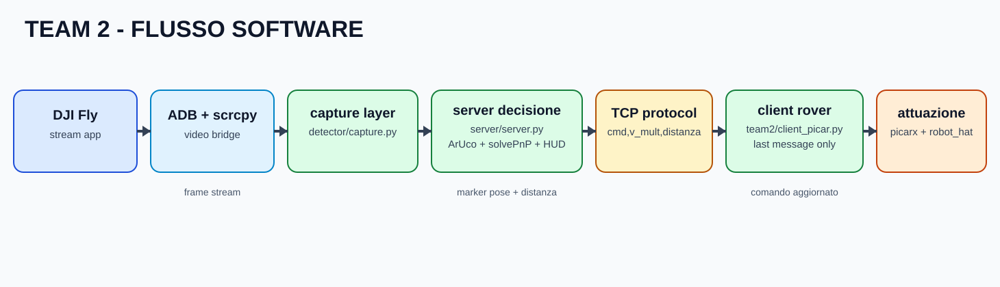

# Team 2 - PiCar-X

Le parti comuni del progetto (detector, tracking ArUco, logica HUD, protocollo logico dei comandi) sono descritte in [README.MD](../README.MD). Questo documento riporta solo i dettagli specifici del client PiCar-X.

Diagramma di flusso:

## In breve

Questa variante usa un client Python sul rover PiCar-X. Il server decide la manovra, il client la riceve via TCP e la traduce in movimenti reali di sterzo e motori.

In pratica:

- server: invia `cmd` e `v_mult`;
- rete TCP: trasporta i messaggi;
- client PiCar-X: applica la manovra piu recente.

## Flusso operativo

Il client mantiene una logica semplice: legge i messaggi, prende l'ultimo comando valido e lo esegue subito. Se arriva un nuovo comando, aggiorna immediatamente il comportamento del rover.

Questa scelta riduce l'effetto "coda" quando la rete o il frame rate non sono stabili.

## Dettagli tecnici essenziali

- Client principale: `team2/client_picar.py`.
- Parsing last-message-only: viene eseguito l'ultimo comando completo, non quelli vecchi nel buffer.
- Attuazione: conversione `cmd`/`v_mult` in velocita e sterzo con logica locale PiCar-X.

I dettagli completi delle funzioni interne restano nel codice per mantenere questo documento leggibile anche a chi non conosce la base software.

## Sicurezza locale

Il client integra protezioni minime ma importanti:

- stop automatico su timeout comando;
- controllo ostacoli con ultrasuoni;
- manovra evasiva e pulizia buffer in caso di rischio collisione.

## Parametri configurabili

I principali parametri configurabili della soluzione sono:

- `base_speed` (risposta generale del rover);
- `turn_pulse_sec` (quanto dura la correzione di sterzo);
- soglia ostacolo ultrasuoni;
- timeout comando (rapidita di stop in assenza flusso).

Questi parametri regolano stabilita, reattivita e sicurezza del comportamento in gara.

## Punti di forza Team 2

- client rover Python chiaro e modificabile con tempi rapidi;
- parsing last-message-only efficace contro backlog e comandi obsoleti;
- buon equilibrio tra semplicita implementativa e robustezza operativa.

